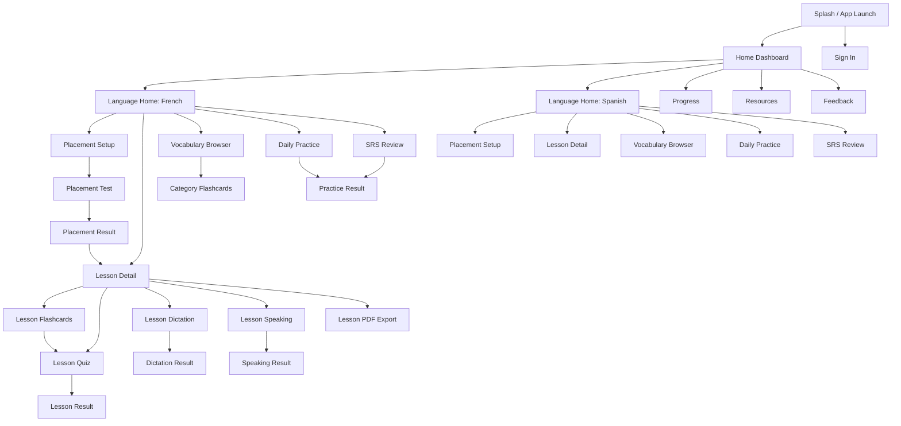

# Language Coach Android UI and Screen Specification

## Purpose

This document defines the Android app screen map, major states, reusable UI patterns, and interaction rules for the current Language Coach product. It is based on the existing Flask routes, templates, and front-end interaction logic so Android agents can implement the mobile experience without inventing behavior.

This is a UI specification, not an API contract. Where the web product currently relies on browser-only behavior or local storage, this document calls that out so Android can preserve the user-facing behavior with native implementations.

## Product Scope Covered

The Android experience must cover these current product areas:

- Dashboard
- Authentication
- Language home and lesson catalog
- Lesson detail
- Vocabulary browser
- Flashcards and SRS review
- Quiz
- Daily practice
- Placement test
- Dictation
- Speaking
- Progress
- Resources
- Feedback

## Source-of-Truth Product Rules

These rules are already true in the current product and should remain true on Android unless another agent changes the product spec intentionally:

- The app supports two target languages: French and Spanish.
- The learner-facing support languages are Bengali and English.
- Some screens are public, but lesson-learning flows requiring saved progress are login-gated.
- Login is email-only. There is no password flow.
- Lesson completion is recorded only when a lesson quiz finishes.
- SRS/word progress updates happen across flashcards, quiz, daily practice, dictation, and speaking.
- Dashboard and progress surfaces show streak/XP/review activity derived from daily activity logs.
- Placement result is saved client-side in the current web app and used to show "continue from my level".
- Speaking and quiz voice-answer behavior use fuzzy speech matching, not exact transcript equality.

## Login Gating Rules

Android keeps the current product's public-browsing shape, but Android must not use an undefined shared anonymous-progress model. Public practice flows that write progress run in a device-local anonymous mode when the user is logged out.

### Public screens

- Dashboard
- Language home
- Vocabulary browser
- Resources
- Progress
- Category flashcards
- Review flashcards
- Daily practice
- Resource drill

### Login-required screens

- Placement test
- Lesson detail
- Lesson PDF export trigger
- Lesson flashcards
- Lesson quiz
- Lesson dictation
- Lesson speaking

### Gating behavior

- If a user opens a gated destination while logged out, route them to Sign in.
- After successful sign-in, return them to the originally requested destination.
- Do not silently drop the deep link.

### Anonymous device-local mode

- Applies to Category Flashcards, Review Flashcards, Daily Practice, and Resource Drill when the user is logged out.
- In this mode, SRS, XP, review counts, and activity state are stored locally on the device only.
- Anonymous local mode does not write shared server progress, server-backed streaks, or shared lesson/word history.
- Logged-in mode keeps the current shared-progress behavior and writes to the backend.
- Do not auto-merge anonymous local progress into server progress in this phase.
- If local-only progress is shown on Dashboard or Progress while logged out, label it clearly as local to this device.

## Android App Structure

### Primary app shell

Use a native app shell with:

- Top app bar on all primary screens
- Bottom navigation for the most frequently visited root destinations
- Per-language color accents and iconography
- Standard Android back behavior between screens

### Recommended bottom navigation tabs

- Home
- Learn
- Practice
- Progress
- Resources

Reasoning:

- This matches the current product’s global navigation while reducing top-level branching on mobile.
- Feedback should not be a bottom tab. Expose it from overflow/help/settings and from contextual entry points.

### Top app bar behavior

- Show screen title and current language context when applicable.
- Show back affordance on non-root screens.
- Show overflow actions for Feedback, audio settings, and account when relevant.
- Keep account access global, not hidden only on Home.

## Screen Map

## Web-to-Android Screen Inventory

| Android screen | Current web route parity | Auth | Notes |
| --- | --- | --- | --- |
| Home Dashboard | `/` | Public | Includes activity, language cards, quick translate/listen, roadmap |
| Sign In | `/login` | Public | Return to requested destination after success |
| Resources | `/resources` | Public | External links only |
| Progress | `/progress` | Public | Shows device-local progress when logged out, or signed-in shared progress data |
| Language Home | `/language/<lang>` | Public | One screen per language |
| Placement Setup/Test | `/placement/<lang>` | Login required | Setup entry starts from language home |
| Lesson Detail | `/lesson/<lang>/<lesson_id>` | Login required | Contains content + lesson-level practice entry points |
| Lesson PDF Export | `/lesson/<lang>/<lesson_id>/download.pdf` | Login required | Android may hand off to download/share flow |
| Lesson Flashcards | `/flashcards/<lang>/<lesson_id>` | Login required | Followed by quiz CTA |
| Vocabulary Browser | `/vocabulary/<lang>` | Public | Search + category filter |
| Category Flashcards | `/flashcards/category/<lang>/<category>` | Public, local-only when logged out | Category-scoped flashcard loop |
| Review Flashcards | `/review/<lang>` | Public, local-only when logged out | Due review first; weak mode uses mistake-based fallback; both fall back to random vocabulary when history is empty |
| Daily Practice | `/practice/<lang>` | Public, local-only when logged out | Mixed-skill practice |
| Resource Drill | `/practice/<lang>?mode=resources` | Public, local-only when logged out | Context/resource-derived practice |
| Dictation | `/dictation/<lang>/<lesson_id>` | Login required | Lesson-scoped |
| Speaking Test | `/speaking/<lang>/<lesson_id>` | Login required | Lesson-scoped |
| Lesson Quiz | `/quiz/<lang>/<lesson_id>` | Login required | The only current lesson-completion trigger |
| Feedback | global modal + `/api/feedback` | Public | Better as native sheet/screen on Android |

## Root Screens

## 1. Home Dashboard

### Goal

Give the learner a fast overview of progress, quick entry to French/Spanish, and utility entry points like translate/listen, practice, review, and resources.

### Content blocks

- Welcome hero
- Activity chips:
  - streak days
  - XP today
  - reviews today
- Language progress cards for French and Spanish
- Continue/Start CTA per language
- Optional review CTA when progress exists
- Daily practice CTA
- Resource drill CTA when personal corpus/resource data exists
- Quick Translate & Listen module
- Learning roadmap / CEFR overview
- Feature shortcuts:
  - vocabulary
  - flashcards
  - quiz
  - practice

### Major states

- First-time state:
  - show Start French / Start Spanish
  - hide resume/review CTAs if no progress
- Active learner state:
  - show Continue Lesson X
  - show review and practice shortcuts
- Partial data state:
  - if only one language has progress, keep both language cards visible
- Empty activity state:
  - do not reserve empty chip rows; simply omit activity chips

### Interaction rules

- Continue CTA opens recommended next lesson if available, otherwise language home.
- Review CTA opens due-word review for that language.
- Daily Practice opens the active language. On web the default can depend on which language has progress; Android should make the chosen language explicit if ambiguous.
- Quick Translate & Listen is a dashboard component only in this spec, not a standalone Android screen.
- Translate & Listen supports source-language selection and text lookup, then shows translated outputs and listen actions.
- Feature shortcuts that are language-specific should open a language picker bottom sheet if the current context is not already known.

## 2. Sign In

### Goal

Allow the user to sign in with email only so lesson progress can be saved.

### Fields

- Email, required
- Keep me logged in on this device, default on

### Optional display

- If user info is already known locally, show "Signed in as {name}" style context

### Major states

- Default
- Validation error for invalid email
- Submitting
- Success and redirect

### Interaction rules

- No password, OTP, or account creation split should be invented in this phase.
- If launched from a gated deep link, redirect back after success.
- Keep copy explicit that progress is stored on the server.

## 3. Resources

### Goal

Present curated external study resources for both languages.

### Structure

- Screen segmented by language
- Within each language, group resources by provider or learning purpose
- Preserve CEFR grouping where it exists

### Major states

- Fully loaded list
- Offline/error state with retry
- External link warning or browser handoff state

### Interaction rules

- Open external links with a clear handoff to browser/custom tab.
- Do not try to recreate the third-party learning content natively.

## 4. Progress

### Goal

Show per-language lesson completion and recent XP history.

### Content

- XP chart for recent active days when data exists
- Progress section for French
- Progress section for Spanish
- Per-language summary:
  - completed lessons
  - total lessons
  - completion percent
- Lesson table/list rows:
  - lesson id
  - icon
  - title
  - CEFR
  - status
  - best score
  - attempts
  - CTA to start/review

### Major states

- Full history state
- No XP history state
- No lesson progress yet state

### Interaction rules

- Tapping a lesson row opens lesson detail.
- Completed lessons use "Review" CTA, incomplete lessons use "Start".
- Avoid desktop table layout; convert to mobile list cards with the same data points.

## Language-Level Screens

## 5. Language Home

There is one instance per language:

- French language home
- Spanish language home

### Goal

Act as the language hub: progress summary, placement entry, lesson catalog, practice shortcuts, and vocabulary entry.

### Header content

- Language name and flag
- Bengali/native subtitle
- Lesson count and CEFR range
- Completed count out of total

### Primary actions

- Resume Lesson
- Daily Practice
- Review
- Vocabulary
- Placement Test

### Placement promo block

Must include:

- explanation of what the placement test does
- choice of test length:
  - Quick
  - Standard
  - Full
- time estimate that updates with test length
- Start Placement Test CTA
- Continue from my last result CTA when a cached placement result exists
- Last result summary:
  - CEFR level
  - overall percent
  - date if known

### Lesson catalog structure

- Group lessons by CEFR:
  - A1
  - A2
  - B1
  - B2
- Each lesson card includes:
  - lesson number
  - icon
  - title
  - short description
  - completion status
  - best score when available
  - CEFR badge

### Major states

- Fresh learner with no progress
- Returning learner with resume lesson
- Placement result available
- All lessons completed

### Interaction rules

- Resume lesson should always route to the recommended next lesson from backend progress.
- Placement "continue from my level" should deep link to the first lesson in the recommended CEFR level.
- Lesson cards must preserve completion markers and best score display.

## Lesson Screens

## 6. Lesson Detail

### Goal

Teach the lesson content and act as the hub for all lesson practice modes.

### Screen sections

- Breadcrumb-equivalent back hierarchy
- Lesson header:
  - lesson id
  - icon
  - English title
  - Bengali title
  - target-language title
- Description card:
  - English description
  - Bengali description
- Optional tip card:
  - tip in English
  - tip in Bengali
- Optional custom lesson activity block:
  - alphabet
  - numbers
- Inline speak-and-match widget
- Vocabulary section
- Grammar section
- Practice actions panel
- Lesson info panel
- Lesson-to-lesson navigation panel

### Vocabulary section requirements

- Search within lesson vocabulary by:
  - target language
  - English
  - Bengali
  - pronunciation
- Vocabulary cards must support:
  - article + word rendering
  - pronunciation badge when present
  - listen action
  - English meaning
  - Bengali meaning
  - optional example triplet:
    - target language
    - English
    - Bengali

### Grammar section requirements

- Intro text in English and Bengali
- Repeating grammar sections
- Optional table rendering
- Section note in English and Bengali

### Practice actions panel

- Flashcards
- Dictation
- Speaking Test
- Take Quiz
- Download PDF

### Lesson info panel

- Language
- CEFR level
- Word count

### Navigation panel

- Previous lesson when available
- All lessons
- Next lesson when available

### Major states

- Standard lesson with vocab + grammar
- Lesson with vocab but no grammar
- Lesson with grammar but minimal vocab
- Lesson with custom activity block
- Missing vocabulary state

### Interaction rules

- Opening a lesson should count as "last seen" for resume logic.
- Lesson completion is not triggered by simply reading the lesson.
- Completion happens only after finishing the lesson quiz.

## 7. Lesson Speak-and-Match Widget

This exists inline on Lesson Detail, separate from the dedicated Speaking Test.

### Goal

Let the learner say any word from the lesson and see the best match result.

### Required UI

- Speak button
- Listen button for matched item when available
- "Heard" transcript line
- No support warning
- Empty vocabulary warning
- Result card with:
  - matched word
  - pronunciation
  - English
  - Bengali
  - match score
  - short note
  - alternative suggestions

### Interaction rules

- Use fuzzy match scoring, not exact equality.
- If speech recognition is unsupported, keep the widget visible but disabled with explanation.
- This widget is informational and practice-oriented. It should not mark the lesson completed.

## Vocabulary and Review Screens

## 8. Vocabulary Browser

### Goal

Provide a searchable, filterable word browser at the language level.

### Controls

- Search field
- Category filter
- Practice Flashcards CTA for selected category

### List item content

- word
- article when present
- pronunciation
- English meaning
- Bengali meaning
- example triplet when present
- listen action

### Major states

- All categories
- Filtered category
- Search results
- No matches

### Interaction rules

- Practice Flashcards CTA is enabled only when a specific category is selected.
- Search and category filter combine.
- On mobile, filters should remain pinned or accessible via sticky chips/filter sheet.

## 9. Flashcards

There are three entry variants:

- Lesson flashcards
- Category flashcards
- Review flashcards

### Shared goal

Run a swipe/tap/card-flip study loop with known vs review marking.

### Shared header data

- title
- subtitle/context:
  - lesson title, or
  - category title with range, or
  - review mode label
- back destination

### Shared UI

- Card counter
- Known count
- Review count
- Progress bar
- Front of card:
  - language tag
  - word
  - pronunciation
  - hint to flip
- Back of card:
  - English
  - Bengali
  - optional example triplet
- Post-flip action row:
  - Need Review
  - I Know It
- Navigation:
  - Previous
  - Listen
  - Shuffle
  - Next
- Completion box:
  - celebratory message
  - restart action
  - next action:
    - Take Quiz for lesson flashcards
    - Back for non-lesson flashcards

### Major states

- Normal study state
- Empty vocabulary state
- Completed-all-cards state

### Interaction rules

- The answer actions appear only after the card is flipped.
- Marking known/review immediately writes word-progress/SRS data.
- Known grants more XP than review in the current web logic.
- Re-answering a card should replace the prior mark, not double-count it.
- Shuffle reorders the deck but does not clear existing answer results unless explicitly restarted.

## 10. Review Flashcards

### Review modes

- Due review
- Weak-word review fallback

### Auth and persistence

- Logged-in users write shared server-backed review progress.
- Logged-out users run review in anonymous device-local mode only.
- Local anonymous review must not update shared server SRS, XP, streak, or review history.

### Rules

- Prefer due words first.
- If no due words exist and weak review is requested, show the highest-error words.
- If there are still no due or weak items, fall back to a random vocabulary review sample for that language.
- Only show an empty state when the language has no vocabulary data at all or review data fails to load.

## Assessment and Practice Screens

## 11. Lesson Quiz

### Goal

Assess lesson knowledge and record lesson completion.

### Question sources

- Vocabulary questions from lesson vocab
- Grammar questions from lesson grammar quiz set when present

### Question types

- word to English
- English to target language
- word to Bengali
- grammar multiple choice

### Required UI

- Question counter
- Score display
- Optional accuracy/transcript status line
- Progress bar
- Question prompt in English
- Prompt support text in Bengali
- Optional listen action
- Optional answer-by-speaking action
- Choice grid
- Inline feedback panel
- Result screen with:
  - percent
  - correct count
  - wrong count
  - total count
  - retry
  - flashcards CTA when applicable
  - next lesson or all lessons CTA

### Major states

- Question state
- Correct feedback state
- Wrong feedback state
- Final result state
- Not-enough-vocabulary state

### Interaction rules

- Once an answer is selected, all choices lock.
- Wrong answer state must reveal the correct answer.
- Voice-answer mode chooses from the visible choices using fuzzy transcript matching.
- At quiz completion, send lesson completion with percent score.
- This is the only current trigger for lesson completion and best score updates.

## 12. Daily Practice

### Goal

Provide mixed-skill practice, prioritizing due words, then unlocked vocabulary.

### Question pool rules

- Prefer due SRS words first.
- Fill remaining slots from unlocked vocabulary.
- "Unlocked" means vocabulary from lessons at or below the recommended/current level.

### Practice question types

- listening MCQ
- word to English MCQ
- English to word MCQ
- typed answer
- sentence ordering
- context cloze when resource sentences exist
- resource drill questions in resource mode

### Required UI

- Question counter
- Hearts
- XP
- Progress bar
- Mode label
- English prompt
- Bengali prompt
- Optional listen action
- Choice grid for MCQ
- Typed-answer area with diacritic helper
- Order-sentence builder
- Inline feedback panel
- Result card

### Auth and persistence

- Logged-in users write shared server progress.
- Logged-out users run this flow in anonymous device-local mode.
- Local anonymous activity should stay on-device and must not update shared server progress.

### Major states

- Standard mixed practice
- Resource drill mode
- Out-of-hearts result
- Completed session result

### Interaction rules

- Start with 3 hearts.
- Wrong answers reduce hearts except in placement mode.
- Both correct and wrong answers still add XP based on question config.
- Each answered word writes SRS progress.
- If hearts reach zero, end the run immediately and show result.
- Resource drill should only be offered when resource-derived sentence data exists.

## 13. Placement Test

### Goal

Estimate a starting CEFR level and guide the learner to the right lesson entry point.

### Setup entry

This begins from Language Home, where the learner chooses:

- Quick
- Standard
- Full

### Test UI

Use the same core layout as Daily Practice with placement-specific behavior.

### Differences from Daily Practice

- No heart loss
- Still show CEFR badge/context
- Track correctness by CEFR level
- Final result recommends one of:
  - A1
  - A2
  - B1
  - B2

### Result content

- Recommended starting level badge
- Bengali explanation
- Breakdown by CEFR:
  - correct
  - total
  - percent
- Retake Test CTA
- Start from my level CTA
- All lessons CTA

### Recommendation rule

- Evaluate correctness per CEFR band.
- The current web behavior uses a 65% threshold.
- Recommend the first level whose score is below threshold or has no data; otherwise recommend the highest level.

### Persistence rule

- Current web behavior stores placement result locally on-device.
- Android should persist the placement result locally per language and expose it on Language Home.

## Speech and Audio Practice Screens

## 14. Dictation

### Goal

Play a word and have the learner type what they hear.

### Required UI

- Word counter
- Score badge
- Progress bar
- Listen/Replay CTA
- hint that `L` replays on web; Android should replace with a replay affordance, not keyboard help
- Typed answer field
- Diacritic helper row
- Accent-tolerance helper copy
- Reveal panel after answer:
  - word
  - pronunciation
  - English
  - Bengali
- Feedback panel
- Result screen

### Major states

- Awaiting first listen
- Answer entry
- Correct feedback
- Wrong feedback
- Final result

### Interaction rules

- Accents are optional in validation.
- After submit, disable the input and show the reveal panel.
- Dictation gives the highest XP among current word-review modes.
- Result screen should summarize percent and correct count.

## 15. Speaking Test

### Goal

Have the learner pronounce a shown target word and score it by fuzzy match.

### Required UI

- Item counter
- Score badge
- Progress bar
- Target word panel:
  - full word
  - pronunciation
  - English
  - Bengali
- Listen button
- Speak button
- No support warning
- Heard transcript line
- Feedback panel
- Final result screen

### Major states

- Ready
- Listening
- Matched correctly
- Try again / incorrect
- Unsupported speech recognition
- Final result

### Interaction rules

- Compare transcript against both `word` and `full_word` when article forms exist.
- Use fuzzy threshold matching.
- Correct and incorrect attempts both write SRS progress with different XP.
- If speech recognition is unsupported, disable action and explain why.

## Cross-Cutting UI Patterns

## 16. Reusable Patterns

Android implementation should standardize these reusable patterns:

### Language accent system

- French screens use French accent color
- Spanish screens use Spanish accent color
- Mixed/global screens use neutral multi-language accent

### CEFR badges

- A1
- A2
- B1
- B2

Must be visually stable and reusable across:

- dashboard roadmap
- language home
- lesson info
- progress
- placement results

### Progress header pattern

Use a compact mobile header with:

- count label
- trailing score or badge
- thin progress bar

Shared by:

- flashcards
- quiz
- practice
- placement
- dictation
- speaking

### Feedback panel pattern

Shared inline feedback component for:

- quiz
- practice
- dictation
- speaking

States:

- correct
- wrong

Must include:

- icon
- short result message
- answer reveal when relevant
- primary CTA to continue

### Vocabulary card pattern

Shared between:

- lesson vocab
- language vocab browser
- word reveal sections

### Empty state pattern

Use one consistent empty-state treatment with:

- clear reason
- next action
- no dead ends

Required for:

- no vocabulary
- no quiz possible
- no search matches
- no due review words
- no resource drill data
- unsupported speech capability where applicable

### Language picker sheet

Use a native bottom sheet for language selection when the user launches a cross-language feature from a neutral context.

### Result screen pattern

Shared pattern for:

- quiz
- practice
- placement
- dictation
- speaking

Must include:

- celebratory or corrective headline
- percent or performance summary
- next-step CTA
- retry option where relevant

## Interaction and State Rules

## 17. Audio Rules

- All listen actions should use a single audio playback component.
- Prevent overlapping audio playback across simultaneous listen triggers.
- Preserve the distinction between server TTS and fallback/native voice behavior where possible.
- If preferred audio playback is unavailable, show a recoverable message instead of failing silently.

## 18. Speech Recognition Rules

- Speaking features should check device capability before enabling the mic action.
- Unsupported state must be explicit, not hidden.
- Fuzzy transcript matching is required for:
  - lesson speak-and-match
  - quiz voice-answer
  - speaking test
- Do not require exact punctuation or accent fidelity for spoken matching.

## 19. Search and Filter Rules

- Search should be case-insensitive.
- Search should consider target word, English, Bengali, and pronunciation where present.
- Category filter and search term must combine.
- Search results should update counts and empty states immediately.

## 20. SRS and XP Rules

Android must preserve the existing activity model:

- Every word-review action can update word progress for the active persistence mode.
- Correct answers move words to a higher Leitner box.
- Wrong answers reset the word to box 1.
- Correct answers schedule later review; wrong answers schedule near-term retry.
- Daily activity aggregates:
  - XP
  - review count
  - correct count
  - wrong count
- Dashboard streak comes from consecutive days with XP activity.

### Persistence modes

- Logged-in mode: write SRS, XP, and activity data to shared server progress.
- Logged-out anonymous mode: keep SRS, XP, and activity data on the device only.
- Do not describe anonymous local data as synced or shared progress anywhere in the UI.

### Current XP differences by mode

- Flashcards:
  - known higher than review
- Quiz:
  - correct 8, wrong 1 for vocab items
- Daily practice:
  - varies by question config
- Dictation:
  - correct 15, wrong 3
- Speaking:
  - correct 12, wrong 3

Android can change presentation of XP, but not the existence of per-action progress updates without a product decision.

## 21. Navigation Rules

- Use standard Android back behavior.
- Preserve explicit "Back to Lesson" or "All Lessons" CTAs on result screens where the current web UI uses them.
- Do not strand the user at the end of a practice flow.
- Next lesson CTA should appear only when a next lesson exists.

## 22. Feedback Submission

### Entry points

- Global overflow/help menu
- Optional contextual entry from error states or account/help areas

### Form fields

- Name
- Email
- Category
- Message
- hidden/system context:
  - language if available
  - current page/screen

### Major states

- default form
- validation error
- sending
- success
- backend failure

### Interaction rules

- Prefill known name/email when available.
- Keep the user on the current screen after successful submission.
- Include current screen context automatically.

## 23. Offline and Failure Handling

At minimum, Android UI should define recoverable states for:

- network unavailable
- TTS fetch/playback failure
- speech recognition unavailable
- feedback submit failure
- progress fetch failure
- empty review data

Recovery actions should include:

- Retry
- Back
- Continue browsing cached/static content where safe

## 24. Accessibility and Mobile-First Requirements

- Large tap targets for answer choices and card actions
- Dynamic text support
- Clear contrast on French/Spanish accent colors
- Do not encode correctness by color alone; pair with icon/text
- Support Bengali text rendering without truncation assumptions
- Keep microphone and speaker actions labeled for screen readers
- Do not depend on keyboard shortcuts for core task completion on Android

## 25. Implementation Notes for Android Agents

### Recommended screen grouping

- `home`
- `auth`
- `learn/language`
- `learn/lesson`
- `practice/flashcards`
- `practice/quiz`
- `practice/session`
- `practice/placement`
- `practice/dictation`
- `practice/speaking`
- `progress`
- `resources`
- `feedback`

### Shared view model domains

- session/auth
- dashboard/activity
- language catalog
- lesson content
- vocabulary/search
- review/SRS
- practice runner
- placement result
- speech/audio capability
- feedback submission

### Components worth reusing

- language header
- CEFR badge
- progress header
- answer choice button
- inline feedback panel
- result summary card
- vocabulary card
- empty/error state card

## 26. Acceptance Checklist

This spec is complete only if the Android implementation can answer these without guessing:

- What are the root navigation destinations?
- Which screens are login-gated?
- How does a learner move from dashboard to lesson to quiz to next lesson?
- What fields and actions appear on lesson detail?
- How do vocabulary search and category filtering work?
- What are the entry variants for flashcards?
- When is a lesson considered completed?
- How do hearts and XP behave in daily practice?
- How is placement different from daily practice?
- What happens when speech is unsupported?
- What does feedback submission collect?
- What empty/error states need dedicated UI?

## 27. Scope Gaps and Explicit Non-Goals

This document intentionally does not define:

- backend API shapes
- database schema changes
- final Material 3 visual styling tokens
- offline sync architecture
- analytics instrumentation
- Play Store packaging

Those should be handled by the relevant backend, Android foundation, or release agents.
